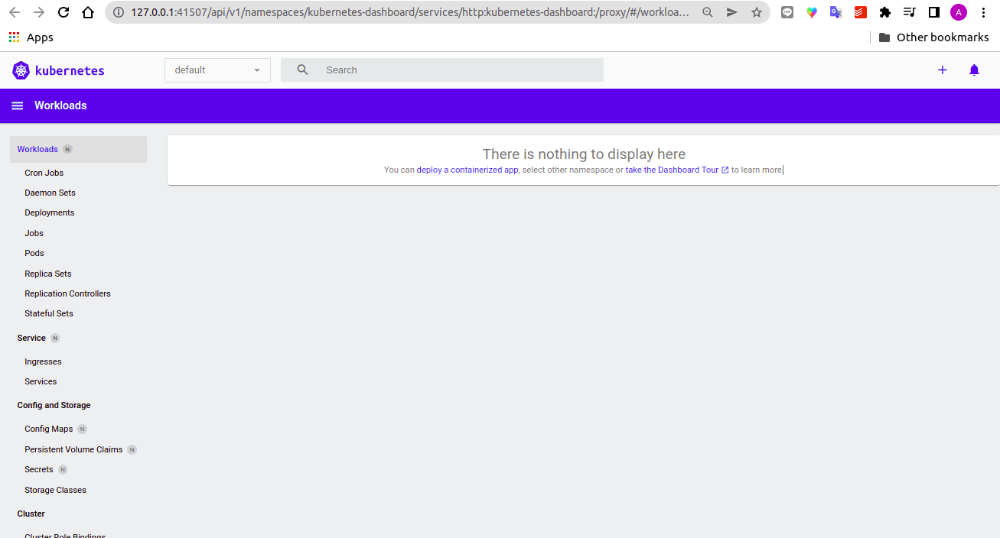

References:
- Installation : https://computingforgeeks.com/how-to-install-minikube-on-ubuntu-debian-linux/
- How it works : https://kubernetes.io/docs/concepts/overview/components/

Usage:
- Start/stop kubernetes: minikube start/stop
- check kubernetes working: kubectl cluster-info

Kubernetes dashboard

